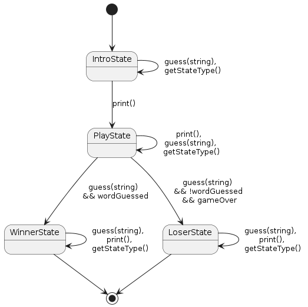
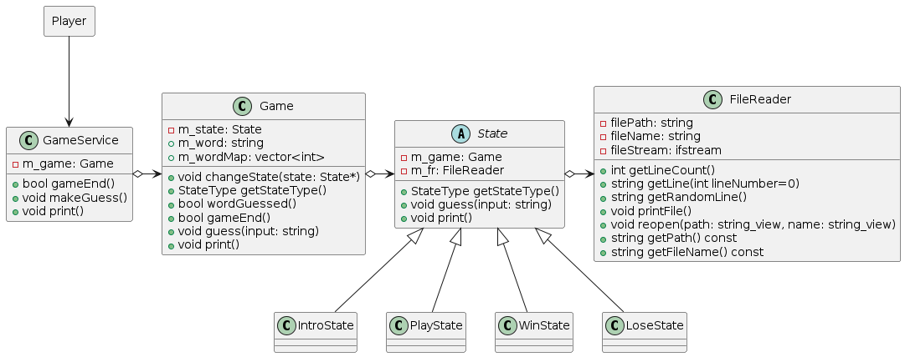

# Project: Hangman

## Concepts

- class
- abstract class
- interface
- inheritance
- polymorphism
- aggregation
- `State` design pattern
- references
- lambda functions
- auto keyword
- `std::array`
- `std::vector`

on old branch (commit-id: dd6db8e):
- friend functions
- operator overloading

## Description

This is a game where the player guesses a word and has a limited number of
tries. If the player can not guess the word before a full hangman picture is
drawn, he loses the game.

## Game Design

In a previous version, I implemented the game in a much simpler way
(commit-id: dd6db8e). Since I want to show different C++ techniques with these
type of projects the following design is a crazy overengineered version.

The game itself can be seen as a state machine with the following states:

- IntroState (start state): prints intro screen
- PlayState: let the player guess the word
- WinnerState (end state): the player has guessed the hidden word
- LoserState (end state): the player did not guess the hidden word in time

Each state has the following functions:

- getStateType(): returns the type of the current state
- print(): prints the corresponding ascii art (is saved as a txt file in the `assets` folder)
- guess(input: string): make a guess

The different states and the corresponding state transitions can be seen in
the following image:



Each state requires to access one or multiple text files in the `assets`
directory that contains corresponding ascii art. For this purpose, I created
a `FileReader` object that allows a client to perform different common file
operations on a specific file.  

We have now the scenario that the state machine has a slightly different
behavior for each state. A common design pattern for this kind of scenario is
the `State` design pattern. More information about this design pattern can be
found under [this link](https://refactoring.guru/design-patterns/state).  

To implement the `State` design pattern, it was necessary to make several
member variables public. This way, each state can influence the state
transitions needed to realize the state machine.  

Although we could utilize the `Game` class to implement the hangman game, we
have exposed some member variables due to the way the `State` pattern is
implemented. To restrict access for clients, we provide another class
`GameService` that only provides the absolute necessary functions to implement
the hangman game. We potentially could utilize another design pattern such as
`Proxy`, `Decorator` or `Facade`.  

All the classes and interfaces that were implemented can be seen in the following
class diagram:



## Build Instructions

```bash
mkdir build
cd build
cmake -DBUILD_EXEC=ON ..
cmake --build ..
./tictactoe
```

## Test Instructions

```bash
mkdir test
cd test
cmake -DUNIT_TEST=ON ..
cmake --build ..
./runTests
```

